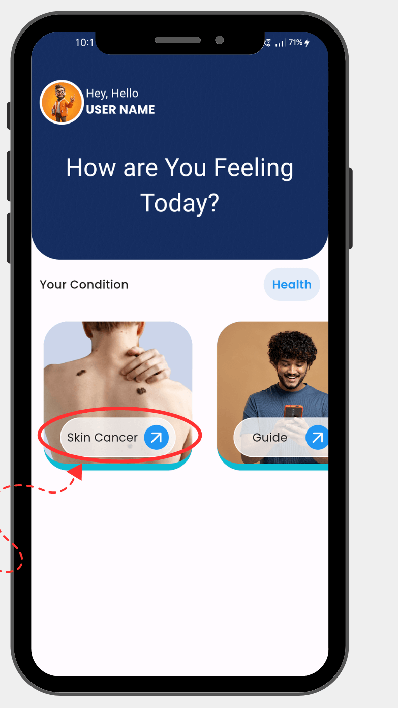
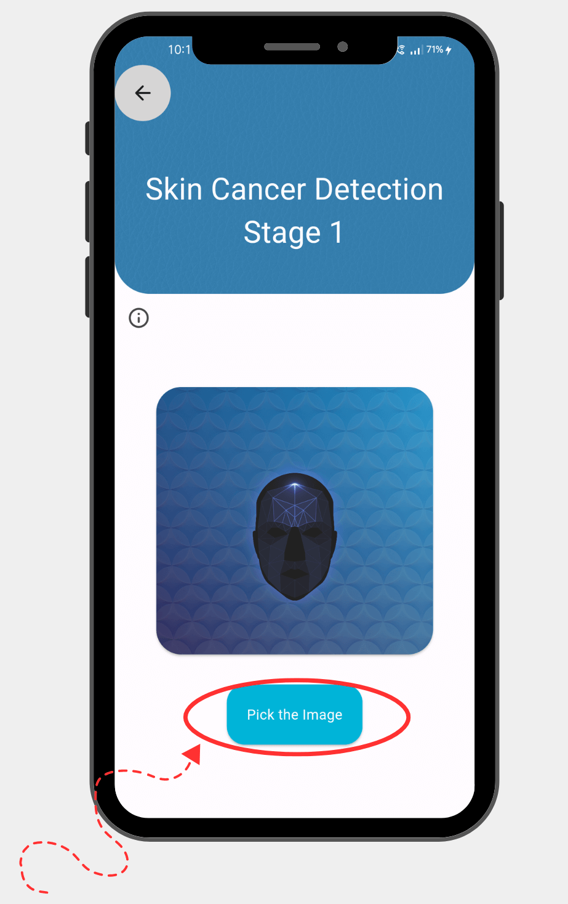
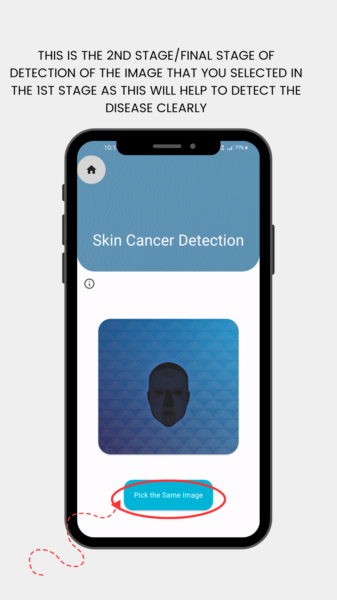
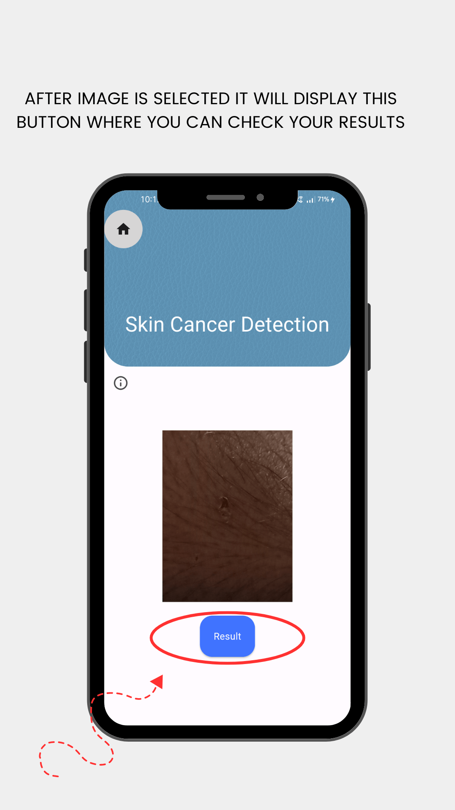
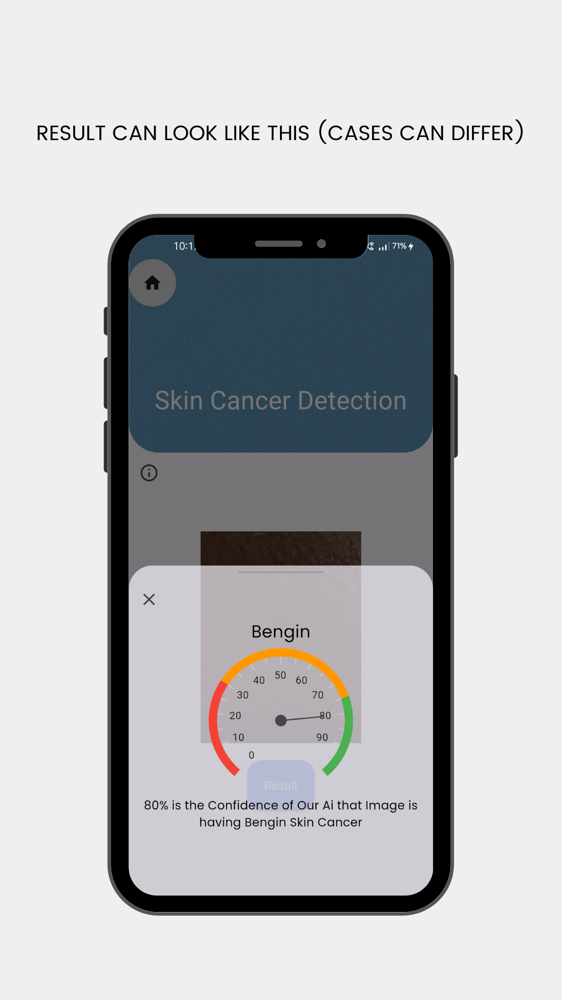

# Skin Healthify

# Skin Cancer Detection App

A Flutter application that uses AI to detect skin cancer from images. This app leverages machine learning models to analyze skin lesions and provide a diagnosis.

## Features

- **AI-Powered Detection**: Uses a trained machine learning model to detect skin cancer.
- **User-Friendly Interface**: Simple and intuitive UI for easy navigation.
- **Real-Time Analysis**: Provides instant feedback on the uploaded images.

## Screenshots

### Home Screen

### Other Features of APP 

### Results Screen

